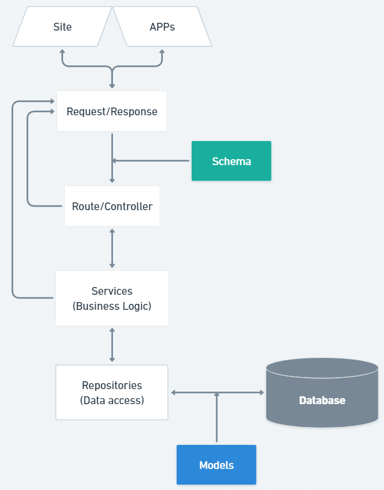

# Index
- [Backend](#backend)
    - [Structurere of Files](#structure-of-files)
    - [](#)

- [Frontend](#frontend)
    -
- [](#)
# Backend
## Structure of Files

1. **Infra** -> **SQLAlchemy** : contains the base model for the database usign the `sqlalchemy` import ;

    <span style="color:cyan">*The SQLAlchemy is an ORM - Object Relational Mapping - a tool to connect to a database. It's used to access the DB and do the operations SQL.*</span>
    
    a. **Config** : the file contains the configuration for the creation, start of <span style="color:red">**every** database in the app</span>. Normally this file is  allways the same - *just paste and copy* ;

    <span style="color:purple">Connects the App to the Database.</span>
    <br><br>
    
    b. **Models** : has the structured representation of the classes in the app on the format **SQL** ;

    The classes created in the file have to heritage from the `Base model` from the **Config File**.

    The first thing to insert in the table must be their name using `__table_name__ = <value>` to gave the name of the table.
    
    <span style="color:purple">Transform an normal class - python class - to an model in database.</span>
    <br><br>

    c. **Repositories** : used to manipulate - create and retrieve data - the Database models ;

    Start from the basic functionalitys of the repository class

    <span style="color:purple">The Repository class are used to convert the Model objects to an Database model. Stablish a conection with de Database.</span>

    ```
    from sqlalchemy.orm import Session

    class Product_Repo():
        def __init__(self, db : Session) -> None:
            pass
        
        def show_products(self):
            ...
        
        def get_by_id(self, id):
            ...
        
        def remove_product(self, id):
            ...
    ```

    ```
    from sqlalchemy.orm import Session
    from src.schemas import schema
    from src.infra.sqlalchemy.models import models


    class Repo_product():
        def __init__(self, db : Session):
            self.db = db
            
        def create_product(self, product : schema.Product):
            db_product = models.Product(
                name = product.name,
                details = product.details,
                price = product.price,
                available = product.available
            )
            
            self.db.add(db_product)  # Adding the product on the database
            self.db.commit()  # Confirm the transaction
            self.db.refresh(db_product)  # Grant the consistency of the datas
            return db_product
            
            
        def show_product(self):
            products = self.db.query(models.Product).all()
            return products
            
        def get_by_id(self, product_id : int):
            ...
            
        def remove_product(self, product_id : int):
            ...
    ```

2. **Models** : ;

3. **Router** : ;

3. **Schema** : ;

3. **Services** : business logic;

3. **Utils** : ;

3. **Server** : stablish the server connection with the database and the frontend;


- The **`shcema.Product`** make the JSON representation of the product ;
- The **`Session = Depends(get_db)`** starts the session with the `config` ;
- The **`Repo_product(db)`** tells where the product will be stored ;
    - The **`.create_product(product)`** converts the shcema.Product - JSON - into a model.Product - SQL ;


# Frontend