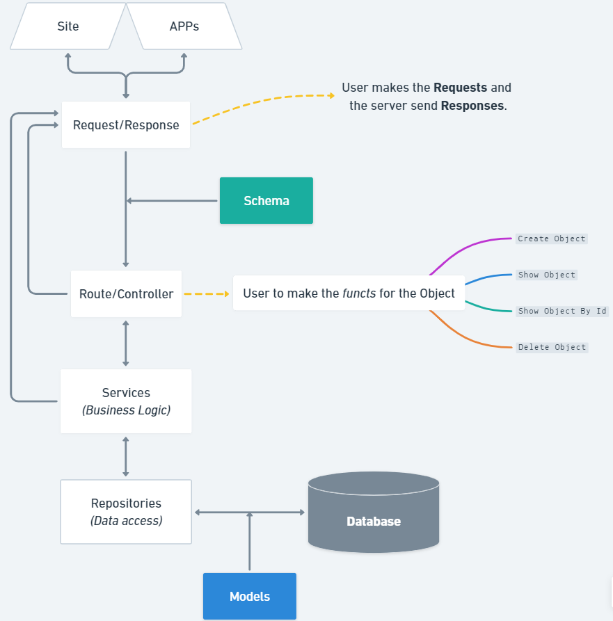
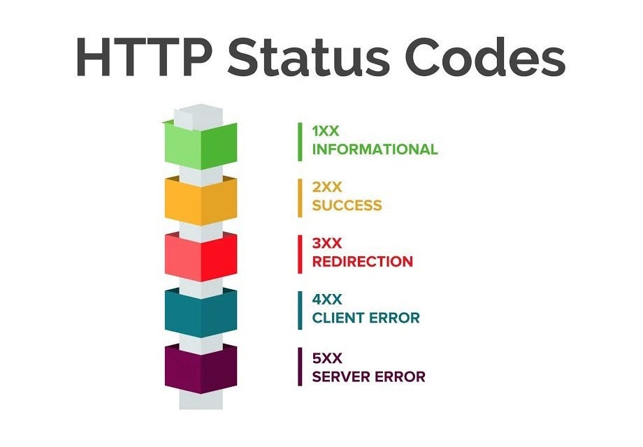

# Index
- [Backend](#backend)
    - [Structurere of Files](#structure-of-files)
    - [Status Code](#status-code)
    - [Alembic - Migrations](#migrations)
    - [Relations between Tables](#relations-between-tables)
    - [](#)

- [Frontend](#frontend)
    - [](#)
- [](#)

# Backend
## Structure of Files


1. **Infra** -> **SQLAlchemy** : contains the base model for the database usign the `sqlalchemy` import ;

    <span style="color:cyan">*The SQLAlchemy is an ORM - Object Relational Mapping - a tool to connect to a database. It's used to access the DB and do the operations SQL.*</span>
    
    a. **Config** : the file contains the configuration for the creation, start of <span style="color:red">**every** database in the app</span>. Normally this file is  allways the same - *just paste and copy* ;

    <span style="color:purple">Connects the App to the Database.</span>
    <br><br>
    
    b. **Models** : has the structured representation of the classes in the app on the format **SQL** ;

    The classes created in the file have to heritage from the `Base model` from the **Config File**.

    The first thing to insert in the table must be their name using `__table_name__ = <value>` to gave the name of the table.
    
    <span style="color:purple">Transform an normal class - python class - to an model in database.</span>
    <br><br>

    c. **Repositories** : used to manipulate - create and retrieve data - the Database models ;

    Start from the basic functionalitys of the repository class

    <span style="color:purple">The Repository class are used to convert the Model objects to an Database model. Stablish a conection with de Database.</span>

    ```
    from sqlalchemy.orm import Session
    from src.schemas import schema
    from src.infra.sqlalchemy.models import models


    class Repo_product():
        def __init__(self, db : Session):
            self.db = db
            
        def create_product(self, product : schema.Product):
            db_product = models.Product(
                name = product.name,
                details = product.details,
                price = product.price,
                available = product.available
            )
            
            self.db.add(db_product)  # Adding the product on the database
            self.db.commit()  # Confirm the transaction
            self.db.refresh(db_product)  # Grant the consistency of the datas
            return db_product
            
            
        def show_product(self):
            products = self.db.query(models.Product).all()
            return products
            
        def get_by_id(self, product_id : int):
            ...
            
        def remove_product(self, product_id : int):
            ...
    ```

2. **Models** : contais the models to transform the object JSON - Schema - into a SQL model ;

3. **Router** : ? ;

3. **Schema** : contais the class object - normal class in python ;

3. **Services** : business logic;

3. **Utils** : utility app...

3. **Server** : stablish the server connection with the database and the backend ;

    Created class in python - Schemas - are transfomed into SQL - Models - by the server connection.

<span style="color:red">**OBS:**<span>

- The **`shcema.Product`** make the JSON representation of the product ;

- The **`Session = Depends(get_db)`** starts the session with the `config` ;

- The **`Repo_product(db)`** tells where the product will be stored ;
    - The **`.create_product(product)`** converts the shcema.Product - JSON - into a model.Product - SQL ;

## Status Code
Improving the *comunication - Request & Response -* between the Frontend and the Backend.



1. **1XX** : Just info ;
    - *It's not very common*

1. **2XX** : Success conection to the server ;
    - Ex.: <span    style="color:yellow">**MSG 200**</span> -> when the request/response is successfully processed ;

1. **3XX** : Redirection to other server ;
    - *It's not very common*

1. **4XX** : When the informations isn't send correctly by the client ;
    - Ex.: <span style="color:red">**ERROR 404**</span> -> is an common error in the web ;

1. **5XX** : When the informations isn't sent correctly by the server ;

<span style="color:red">**OBS:**</span> U can change the StatusCode Mensage by usign this:

```
    app.get('route', status_code = value_code)
    def create():
    ...
```
This status code will be shown when the request/response is successfully processed.


## Response Model
Make the validation of the response model.

*By using this you can handle the response to use however you want.*
```
    app.get('route', response_model = model)
    def create():
    ...
```


## Migrations
**Evolutions of the Database**

* Adding new Tables, or making changes in the tables...

1. `pip install alembic` : alembic is used do upgrade the database ;

2. `alembic init alembic` : Use alembic on the root of your app ;
    - This will create a Folder Alembic and an File Alembic.ini

2. In that folder go to the `env.py` and :
    - Import the Base Class : `from ..backend.src.infra.sqlalchemy.config.database import Base`
    - Import all the Models : `from ..backend.src.infra.sqlalchemy.models.models import *`
    - Change the Target Metadata : `target_metadata = Base.metadata`

2. On the app `alembic.ini` insert the URL of the Database **without the " "** : `sqlalchemy.url =  sqlite:///./app_blx.db` ;

2. Generate and execute the review of your db :
    - `alembic revision --autogenerate -m "Just a msg. Added new test column"`
        
        <span style="color:cyan">Every time u change the DB.</span>

    - `alembic upgrade head`

        <span style="color:cyan">To commit that change.</span>


## Relations between Tables
In the Models app u have to add the relationship.


# Frontend
<span style="color:red">**OBS:**</span>